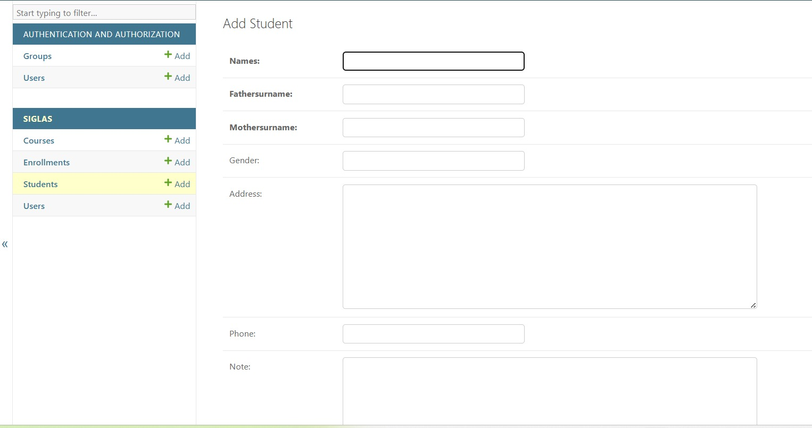
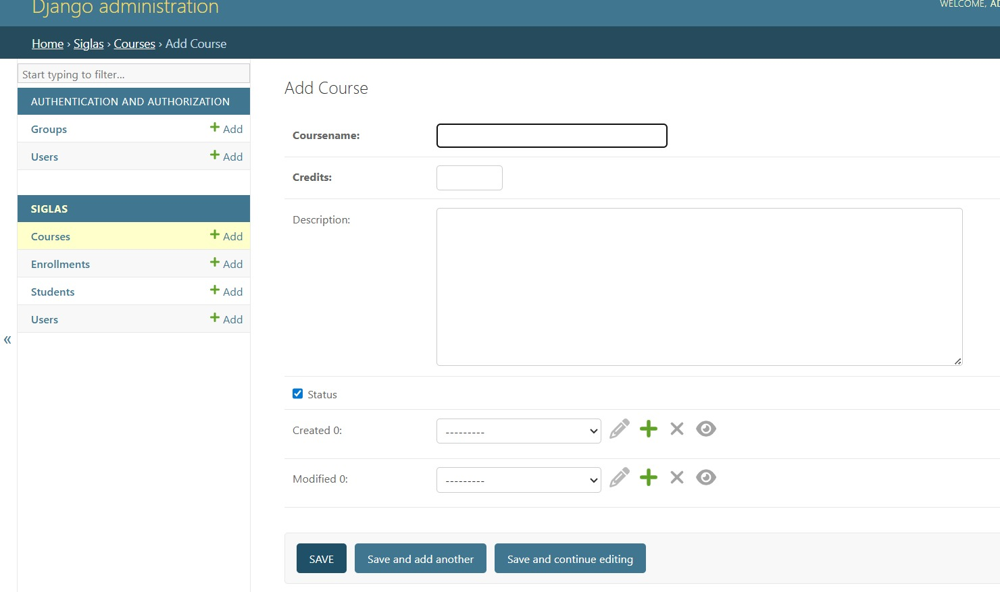
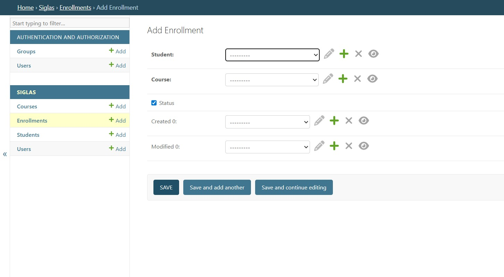

# Laboratorio 06 - Django Admin | Sistema de Matrículas

Proyecto desarrollado para el curso de Desarrollo de Aplicaciones Web (DAW) utilizando Django, PostgreSQL y el panel administrativo de Django Admin.

El objetivo principal de esta práctica es implementar:

- Persistencia de datos
- Administración mediante Django Admin
- Validaciones y restricciones
- Auditoría de registros
- Relaciones entre entidades
- Buenas prácticas de modelado y nomenclatura

---

# Tecnologías Utilizadas

- Python
- Django
- PostgreSQL
- Django Admin
- Git & GitHub
- Virtual Environment (venv)

---

# Configuración del Proyecto

## 1. Clonar el repositorio

```bash
git clone https://github.com/SantyGutRamos/Daw_laboratorio6.git
cd Daw_laboratorio6
```

---

## 2. Crear y activar el entorno virtual

### Linux / macOS

```bash
python3 -m venv venv
source venv/bin/activate
```

### Windows

```bash
python -m venv venv
venv\Scripts\activate
```

---

## 3. Instalar dependencias

```bash
pip install -r requirements.txt
```

---

## 4. Ejecutar migraciones

```bash
python manage.py migrate
```

---

## 5. Crear superusuario

```bash
python manage.py createsuperuser
```

---

## 6. Ejecutar el servidor

```bash
python manage.py runserver
```

---

# Modelo Entidad - Relación (DER)

El sistema se encuentra compuesto por las siguientes entidades principales:

- Users
- Students
- Courses
- StudentsCourses

La tabla `StudentsCourses` resuelve la relación muchos a muchos entre estudiantes y cursos.

```text
[Users] 1 ------- 0..* [Students]

[Users] 1 ------- 0..* [Courses]

[Students] 1 ---- 0..* [StudentsCourses] * ---- 1 [Courses]
```

---

# Arquitectura del Proyecto

Los modelos fueron desarrollados en archivos independientes para mantener una arquitectura modular y escalable.

## Características Implementadas

- Campos obligatorios de auditoría
- Validadores personalizados
- Sobreescritura del método `save()`
- Uso de relaciones `ForeignKey`
- Integración con Django Admin
- Gestión automática de fechas de creación y modificación

---

# Campos de Auditoría

Todas las tablas principales implementan los siguientes campos:

```text
status
created
modified
created_id
modified_id
```

Estos campos permiten:

- Control de estado lógico
- Trazabilidad de registros
- Auditoría de operaciones
- Seguimiento de modificaciones

---

# Django Admin

Se configuró el panel administrativo de Django para permitir operaciones CRUD automáticas sobre las entidades del sistema.

---

# Funcionalidades Implementadas

## Registro de Estudiantes

- Creación de estudiantes desde Django Admin
- Conversión automática de nombres a mayúsculas
- Validaciones de teléfono
- Gestión de estados

---

## Registro de Cursos

- Gestión de cursos
- Validación de créditos
- Control de estados
- Administración desde el panel de Django

---

## Matrícula de Estudiantes

- Relación entre estudiantes y cursos
- Gestión mediante tabla intermedia `StudentsCourses`
- Selección desde listas desplegables
- Persistencia automática de relaciones

---

# Capturas del Sistema

## Crear Estudiante



---

## Crear Curso



---

## Matrícula de Estudiante



---


---

# Conclusiones

- Django Admin permite acelerar significativamente el desarrollo de aplicaciones CRUD.
- Las validaciones implementadas en los modelos garantizan la integridad de los datos.
- Los campos de auditoría facilitan el seguimiento y control de cambios.
- PostgreSQL ofrece una integración robusta y eficiente con Django.
- La modularización mejora la mantenibilidad y escalabilidad del proyecto.

# URL del video
-
